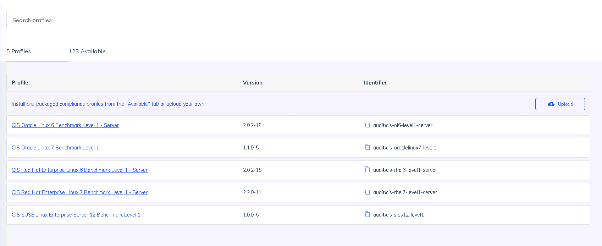
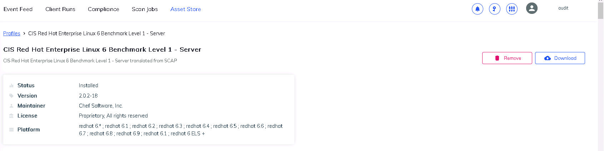
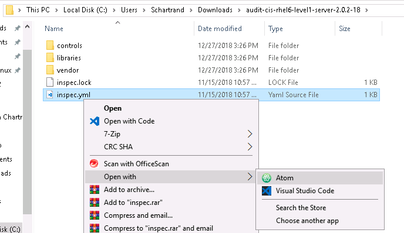
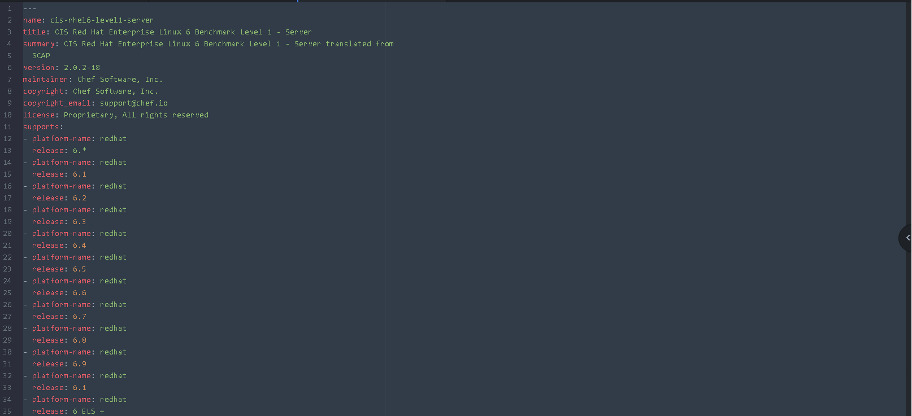
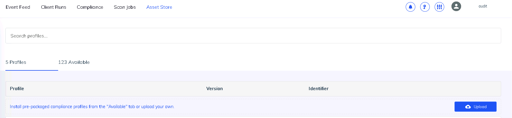
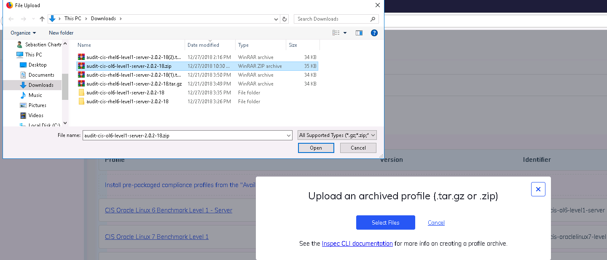

# fai_linux_audit

Set automatic scan for various Linux distributions.

## Requirements

### Platforms
- RHEL/Oracle 6+
- RHEL/Oracle 7+
- Suse Entreprise 12+

### Chef

- Chef 13+


## Cookbook Dependencies

This cookbooks depedns on the [audit](https://supermarket.chef.io/cookbooks/audit) cookbook from Chef.

## Chef automate
A  generic user 'audit' was setup on the Chef automation server.

The following compliance report were downloaded from Asset store:


- CIS Oracle Linux 7 Benchmark Level 1
1.1.0-5
audit/cis-oraclelinux7-level1
- CIS Red Hat Enterprise Linux 6 Benchmark Level 1 - Server
2.0.2-18
audit/cis-rhel6-level1-server
- CIS Red Hat Enterprise Linux 7 Benchmark Level 1 - Server
2.2.0-11
audit/cis-rhel7-level1-server
- CIS SUSE Linux Enterprise Server 12 Benchmark Level 1
1.0.0-6
audit/cis-sles12-level1

Linux Oracle 6 was not avaiable from the asset store. So  from the `Asset store`, in the profiles tabs.



Click on the *CIS Red Hat Enterprise Linux 6 Benchmark Level 1*  and the press the download button.


 


Extrack the downloaded file and modify the inspect.yaml  file.



The original File looks liket this :

#
```
klkklk

---
name: cis-rhel6-level1-server
title: CIS Red Hat Enterprise Linux 6 Benchmark Level 1 - Server
summary: CIS Red Hat Enterprise Linux 6 Benchmark Level 1 - Server translated from SCAP
version: 2.0.2-18
maintainer: Chef Software, Inc.
copyright: Chef Software, Inc.
copyright_email: support@chef.io
license: Proprietary, All rights reserved
supports:
- platform-name: redhat
  release: 6.*
- platform-name: redhat
  release: 6.1
- platform-name: redhat
  release: 6.2
- platform-name: redhat
  release: 6.3
- platform-name: redhat
  release: 6.4
- platform-name: redhat
  release: 6.5
- platform-name: redhat
  release: 6.6
- platform-name: redhat
  release: 6.7
- platform-name: redhat
  release: 6.8
- platform-name: redhat
  release: 6.9
- platform-name: redhat
  release: 6.1
- platform-name: redhat
  release: 6 ELS +

```

Get rid of all the :

```

 - platform-name: redhat

  release: 6.1
```
And rename Red Hat Enterprise Linux to Oracle Linux.

Final result shoud look like this :
```
---
name: cis-ol6-level1-server
title: CIS Oracle Linux 6 Benchmark Level 1 - Server
summary: CIS Oracle Linux 6 Benchmark Level 1 - Server translated from
  SCAP
version: 2.0.2-18
maintainer: Chef Software, Inc.
copyright: Chef Software, Inc.
copyright_email: support@chef.io
license: Proprietary, All rights reserved
supports:
- platform-name: oracle
  release: 6.*
```
Rename  audit-cis-rhel6-level1-server-VersionNumber to audit-cis-ol6-level1-server-VersionNumber.

Zip the folder and upload it to your chef automate server.





