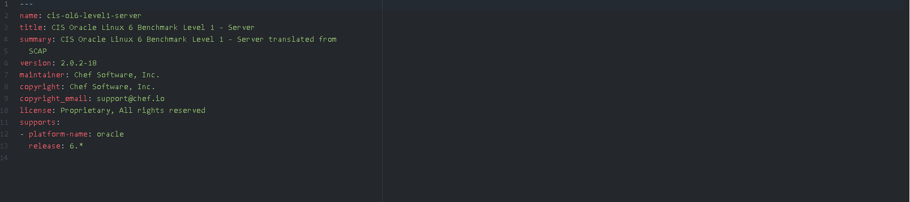

# fai_linux_audit

Set automatic scan for various Linux distributions.

## Requirements

### Platforms
- RHEL/Oracle 6+
- RHEL/Oracle 7+
- Suse Entreprise 12+

### Chef

- Chef 13+

## Cookbook Dependencies

This cookbooks depends on the [audit](https://supermarket.chef.io/cookbooks/audit) cookbook from Chef.

## Chef automate
A  generic user 'audit' was setup on the Chef automation server.

The following compliance report were downloaded from Asset store:

- CIS Oracle Linux 7 Benchmark Level 1
1.1.0-5
audit/cis-oraclelinux7-level1
- CIS Red Hat Enterprise Linux 6 Benchmark Level 1 - Server
2.0.2-18
audit/cis-rhel6-level1-server
- CIS Red Hat Enterprise Linux 7 Benchmark Level 1 - Server
2.2.0-11
audit/cis-rhel7-level1-server
- CIS SUSE Linux Enterprise Server 12 Benchmark Level 1
1.0.0-6
audit/cis-sles12-level1

Linux Oracle 6 was not avaiable from the asset store. So to solved this, from the `Asset store`, in the profiles tabs.

Click on the *CIS Red Hat Enterprise Linux 6 Benchmark Level 1*  and the press the download button

Extract the downloaded file and modify the inspect.yaml file.

The original File looks liket this :

Get rid of all the

 - platform-name: redhat

  release: 6.1

And rename Red Hat Enterprise Linux to Oracle Linux.

Final result shoud look like this :

Rename audit-cis-rhel6-level1-server-VersionNumber to audit-cis-ol6-level1-server-VersionNumber.

Zip the folder and upload it to your chef automate server.

